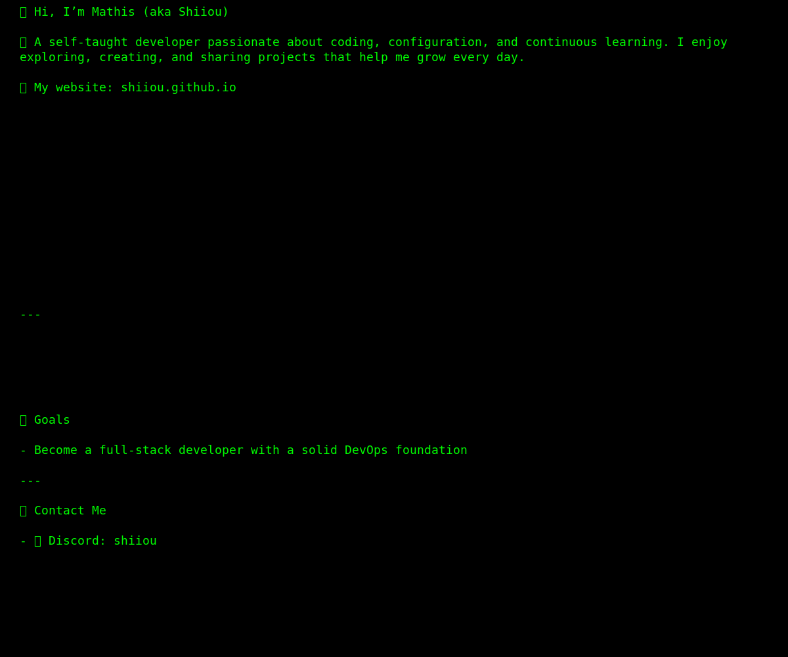

  

  
    

  
  
---

## 🚀 Skills  

---

## 📌 Portfolio  

  

---

## 📊 GitHub Stats  

  
  

----

  
  <pre style="color:#00ff00; background:#000; padding:10px; border-radius:8px; display:inline-block;">  
    
  </pre>  

