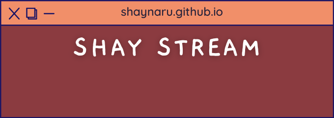

  
    

  
  
## 👨‍💻 I'm Mathis alias Shay, a Developer & Graphic Design in self-taught since 2019
 
- 🎮 I’m currently not working
  
- 💻,🎨,📷,🎬  

<!--
- ⚡ My networks | [Instagram](https://www.instagram.com/ls_twitch/) • [Twitter](https://twitter.com/LittleShiiou) • [Discord](https://discord.gg/aVZb4emM69)
-->

----

# Programming

  
    
    
    

## UI/UX Design  

  
    

## Graphic Design

  
    

   

## My computer

   
   

  
----

  
    

